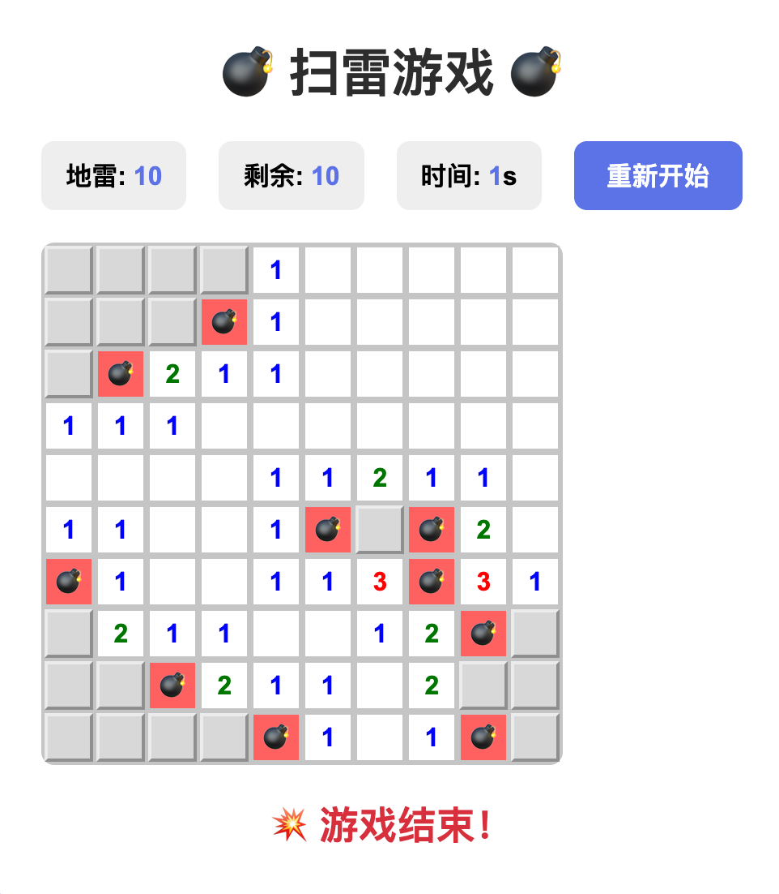

# 💣 扫雷游戏 (Minesweeper)

一个使用原生 HTML、CSS 和 JavaScript 开发的经典扫雷游戏。

## 🎮 游戏介绍

扫雷是一款经典的单人益智游戏，目标是在不触雷的情况下，揭开所有不含地雷的方格。游戏通过数字提示周围地雷的数量，需要玩家运用逻辑推理来找出所有地雷的位置。

### 游戏特性

- 📊 **10x10 棋盘**：100个方格，包含10个随机分布的地雷
- ⏱️ **实时计时**：记录游戏时间
- 🚩 **地雷标记**：可以标记可疑的地雷位置
- 🎯 **智能揭示**：点击空白区域自动展开周围安全区域
- 🎨 **精美UI**：现代化的渐变背景和流畅的交互体验
- 🔄 **即时重置**：随时开始新游戏

## 🎯 游戏玩法

### 基本规则

1. **游戏目标**：揭开所有不含地雷的方格即可获胜
2. **失败条件**：点击到地雷方格即游戏结束

### 操作方式

- **左键点击**：揭示方格
  - 如果是地雷 💣，游戏结束
  - 如果是数字，显示周围8个方格中地雷的数量（1-8）
  - 如果是空白，自动揭示周围的安全区域

- **右键点击**：标记/取消标记地雷 🚩
  - 用于标记你认为是地雷的方格
  - 被标记的方格无法被左键点击揭示
  - 再次右键点击可取消标记

### 数字含义

方格中的数字（1-8）表示其周围8个方格中地雷的数量：
- **蓝色 1**：周围有1个地雷
- **绿色 2**：周围有2个地雷
- **红色 3**：周围有3个地雷
- **深蓝 4**：周围有4个地雷
- **褐色 5**：周围有5个地雷
- **青色 6**：周围有6个地雷
- **黑色 7**：周围有7个地雷
- **灰色 8**：周围有8个地雷

### 游戏技巧

1. **从边角开始**：第一次点击绝对安全，建议从边角或大片区域开始
2. **利用数字推理**：根据数字和已揭示的方格推断地雷位置
3. **标记地雷**：确定地雷位置后立即标记，避免误触
4. **观察剩余地雷数**：顶部显示剩余未标记的地雷数量

## 🚀 如何开始

### 在线游玩

直接在浏览器中打开 `minesweeper.html` 文件即可开始游戏。

```bash
# 克隆仓库
git clone https://github.com/hadesjin/ClaudeCode.git

# 进入目录
cd ClaudeCode/minesweeper

# 在浏览器中打开
open minesweeper.html  # macOS
# 或
start minesweeper.html # Windows
# 或
xdg-open minesweeper.html # Linux
```

### 系统要求

- 现代浏览器（Chrome、Firefox、Safari、Edge 等）
- 支持 JavaScript
- 支持鼠标右键菜单

## 📸 游戏截图

### 游戏初始界面


### 游戏进行中


### 游戏胜利


### 游戏失败


## 🛠️ 技术实现

- **纯前端实现**：无需服务器，单个 HTML 文件包含所有代码
- **原生 JavaScript**：不依赖任何框架或库
- **面向对象设计**：使用 ES6 Class 封装游戏逻辑
- **响应式 CSS**：现代化的 Flexbox 和 Grid 布局
- **优雅的渐变背景**：紫色渐变提升视觉体验

### 核心功能

- 地雷随机生成算法
- 递归区域揭示算法
- 实时游戏状态管理
- 计时器功能
- 胜利/失败判定

## 📝 更新日志

### v1.0.0 (2025-10-04)

- ✨ 初始版本发布
- ✅ 实现完整的扫雷游戏逻辑
- 🎨 添加精美的界面设计
- ⏱️ 添加计时功能
- 🚩 支持地雷标记功能

## 📄 许可证

MIT License

## 👨‍💻 作者

由 Claude Code 辅助开发

---

**享受游戏！如果喜欢请给个 Star ⭐**
